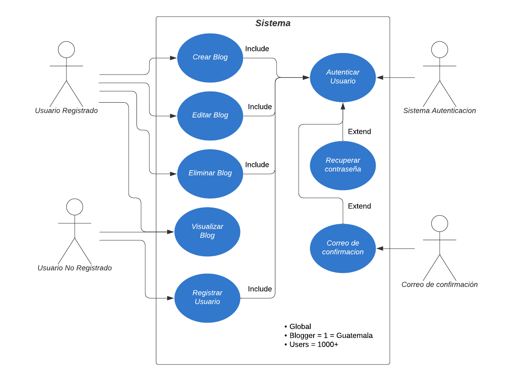

# Titulo: Blog Personal

## Problema a resolver
Estàs desarrollando un sistema para un blog personal. El sistema debe permitir a los usuarios autenticarse y gestionar sus entradas de blog, las cuales deben poder formatearse de manera enriquecida. Se espera que el sistema sea eficiente, seguro y escalable.

### Requerimiento 1: Autenticaciòn de Usuarios
Implementa un sistma de autenticaciòn que permita a los usuarios registrarse y acceder al sistema. La autenticaciòn debe ser robusta y garantizar que los usuarios puedan indetificarse de manera segura.

**Especificaciones:**
- Los usuarios deben poder crear una cuenta e iniciar sesiòn.
- Una vez autenticados, deben poder acceder a sus recursos privados.
- El sistema debe manejar las credenciales de forma segura y permitiendo el acceso a las operaciones que requieran autenticacion.

### Requerimiento 2: Gestion de Contenido del Blog
El sistema debe permitir a los usuarios autenticados crear, editar y eliminar contenido del blog. El contenido debe ser formateado de manera que permita texto enriquecido.

**Especificaciones:**
- Los usuarios deben poder escribir y visualizar su contenido de manera enriquecida.
- Debe existir un mecanismo para que los usuarios gestiones sus publicaciones (crear, editar y eliminar).
- El contenido debe poder ser almacenado y mostrado de forma consistente para su visualizacion.

### Consideraciones Generales del Proyecto:
- El sistema debe estar diseñado pensado en la seguridad, garantizando que solo los usuarios autenticados puedan realizar acciones sesibles.
- El manejo de errores debe estar correcatmente implementado, proporcionado mensajes claros y precisos.
-  Se debe asegurar una correcta relacion entre los usuarios y el contenido de gestion.

## Casos de uso
### Requerimiento 1:
* Como usuario no registrado, quiero poder registrarme e ingresar al blog con mis credenciales.
* Como usuario registrado, quiero poder acceder al blog y gestionar las publicaciones.
* Como usuario no registrado, quiero poder ver los blog sin necesidad de estar autenticado.

### Requerimiento 2:
* Como usuario registrado, quiero poder crear blog con mi contenido.
* Como usuario registrado, quiero poder actualizar mi contenido ya publicado.
* Como usuario registrado, quiero poder eliminar mi contenido que no es util.


## Casos de uso No Soportados
* Como usuario no registrado, quiero poder modificar un blog ya creado.
* Como usuario no registrado, quiero crear un blog sin necesidad de estar autenticado.

## Arquitectura

### Diagrama Caso de Uso



### Diagrama de arquitectura


### Diagrama de bajo nivel


### Entidad Relacion


---
## Despliegue: Planes y Limitaciones de Microsoft Azure

### 1. Plan Gratuito
- **Precio:** Gratis
- **Disponibilidad:** 60 días.
- **Ancho de Banda:**
  - **Límite:** 100 GB por suscripción por mes.
  - **Uso Excesivo:** Gratis, pero puede resultar en la suspensión temporal del servicio si se excede el límite.
- **Dominios Personalizados:** Hasta 2 por aplicación.
- **Certificados SSL:** Gratis (solo para los dominios personalizados proporcionados).
- **Autenticación Personalizada:** No disponible; solo se pueden usar los proveedores de autenticación predefinidos.
- **Puntos de Conexión Privados:** No disponible.
- **Capacidad de Almacenamiento:** Tamaño máximo de la aplicación de 250 MB.
- **Entornos de Ensayo:** Hasta 3 entornos (staging) para pruebas de despliegue.
- **Azure Functions:** Administradas (sin costo adicional).
- **Perímetro de Seguridad:** No se puede configurar un perímetro de seguridad de nivel empresarial.

**Total Mensual para el Plan Gratuito:** $0 al mes.

---

### 2. Plan Estándar
- **Precio:** $9.00 USD por aplicación al mes.
- **Disponibilidad:** Vigencia del plan.
- **Ancho de Banda:**
  - **Límite:** 100 GB por suscripción por mes.
  - **Uso Excesivo:** $0.20 USD por cada GB adicional.
- **Dominios Personalizados:** Hasta 5 por aplicación.
- **Certificados SSL:** Gratis.
- **Autenticación Personalizada:** Disponible.
- **Puntos de Conexión Privados:** Disponible.
- **Capacidad de Almacenamiento:** Tamaño máximo de la aplicación de 500 MB.
- **Entornos de Ensayo:** Hasta 10 entornos (staging) para pruebas de despliegue.
- **Azure Functions:** Administradas o con opción a incorporar funciones propias. Costo adicional de $17.52 USD por mes si se elige la administración avanzada.
- **Perímetro de Seguridad:** Disponible para un mayor nivel de protección.

**Total Mensual para el Plan Estándar (sin excedente de ancho de banda):**
- Precio base: $9.00 USD
- Azure Functions (opcional): $17.52 USD

**Total mensual estimado:** $9.00 USD + $17.52 USD = **$26.52 USD**.

---

### 3. Resumen de Costos
| Plan                         | Precio Base | Azure Functions (Opcional) | Total Mensual Estimado |
|------------------------------|-------------|----------------------------|------------------------|
| Gratuito                    | $0          | $0                         | $0                     |
| Estándar (sin excedente)    | $9.00 USD   | $17.52 USD                 | $26.52 USD             |

**Nota:** En el plan estándar, si se excede el límite de 100 GB de ancho de banda, se cobrará $0.20 USD por cada GB adicional.

## Diseño

### Paquetes
- Entity Framework CORE
- Entity Framework In Memory
- Entity Framework SQL SERVER
- Entity Framework Tools
- Authentication JwtBearer

### Crear .gitignore
```csharp
dotnet new gitignore
```

### Crear Modelos
```csharp
Scaffold-DbContext "Data Source=LAPTOP-07NSNMOC;Initial Catalog=PersonalBlog;user id=sa;password=loc@del@rea;TrustServerCertificate=True" Microsoft.EntityFrameworkCore.SqlServer -OutputDir Models
```

### Actualizar Modelos
```csharp
Add-Migration NombreDeLaMigracion
```

```csharp
Update-Database
```

### Arquitectura Codigo
- Model
- Controller
- Services